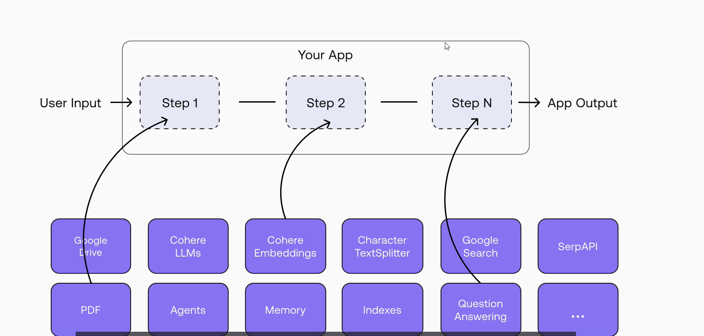

## Chains

Chains allow us to combine multiple components together and create one single coherent application, so we can build more complex chains by combining multiple chains together or combining chains with other components like agents.

  

